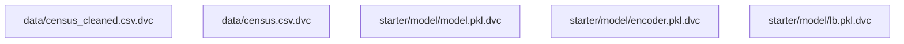

# Census Income Inference API
[](https://github.com/phidesigner/nd0821-c3-starter-code/actions/workflows/python-package-conda.yml)

## Objective
The Census Income Inference API predicts whether a person earns <=50K or >50K based on the Census Income dataset. It preprocesses input data, runs inference using a pre-trained Random Forest model, and returns the predicted income class.

The project includes scripts for data preprocessing, model training, API integration, and testing.

---

## Directory Structure
```
├── data
│   ├── census.csv                # Raw dataset
│   ├── census.csv.dvc            # DVC tracking for raw dataset
│   ├── census_cleaned.csv        # Cleaned dataset
│   ├── census_cleaned.csv.dvc    # DVC tracking for cleaned dataset
│   └── data_eda.ipynb            # Exploratory data analysis notebook
├── debug.log                     # Debug log file
├── environment.yml               # Conda environment file
├── requirements.txt              # Python requirements file
├── screenshots                   # Folder for screenshots
│   ├── CD_on_Railways.png
│   ├── CI_CD_WaitforCI_github.png
│   ├── CI_Github_Actions.png
│   ├── FastAPI_GET.png
│   ├── FastAPI_Health.png
│   ├── FastAPI_POST.png
│   └── Programmatic_test.png
├── starter
│   ├── README.md                 # API documentation
│   ├── __init__.py               # Init file for starter module
│   ├── main.py                   # API application entry point
│   ├── ml
│   │   ├── __init__.py           # Init file for ml module
│   │   ├── data.py               # Data preprocessing utilities
│   │   └── model.py              # Model training and inference utilities
│   ├── model
│   │   ├── encoder.pkl           # OneHotEncoder for categorical features
│   │   ├── encoder.pkl.dvc       # DVC tracking for encoder
│   │   ├── lb.pkl                # Label binarizer for target variable
│   │   ├── lb.pkl.dvc            # DVC tracking for label binarizer
│   │   ├── logs
│   │   │   ├── api_logs.log      # Logs for API usage
│   │   │   ├── slice_output.txt  # Model performance on data slices
│   │   │   └── train_model.log   # Logs from training process
│   │   ├── model.pkl             # Trained model for income prediction
│   │   ├── model.pkl.dvc         # DVC tracking for the trained model
│   │   └── model_card.md         # Documentation detailing the model's design and evaluation
│   ├── sanitycheck.py            # Sanity checks for the project
│   └── train_model.py            # Model training script
└── tests
    ├── __init__.py               # Init file for tests module
    ├── test_main.py              # Unit tests for main.py
    └── test_model.py             # Unit tests for ml/model.py
```

---

## Deployment Details
The model is deployed using Railways.com. Below are the API details:
- **API Base URL:** `https://nd0821-c3-starter-code-production.up.railway.app`
- **Inference Endpoint:** `${base_url}/inference`

The deployment workflow includes a CI/CD pipeline with a feature to wait for all GitHub Actions CI tests to pass before deployment. Additionally, it includes automated notifications for failed tests and an optional rollback mechanism for robust deployments.

---

## DVC Tracking
The following files are tracked and managed using DVC with a remote S3 backend:


---

## Features
- **Model Training:** Automates preprocessing, model training, evaluation, and artifact saving
- **Inference API:** Predicts income class for input data
- **Health Checks:** Validates API readiness and dependencies
- **Testing Framework:** Includes unit and integration tests

---

## Installation
1. **Clone the Repository:**
   ```bash
   git clone https://github.com/phidesigner/nd0821-c3-starter-code.git
   cd project
   ```

2. **Set Up Environment:**
   ```bash
   conda env create -f environment.yml
   conda activate API
   ```

3. **Start the API:**
   ```bash
   python -m starter.main
   ```
   Access the API at [http://0.0.0.0:8000](http://0.0.0.0:8000).

---

## API Endpoints

### Root Endpoint
**GET /**
- **Description:** Returns a welcome message.
- **Response:**
  ```json
  {"message": "Welcome to the Census Income Inference API!"}
  ```

### Health Check
**GET /health**
- **Description:** Verifies API readiness.
- **Response:**
  ```json
  {"status": "healthy"}
  ```

### Inference
**POST /inference**
- **Description:** Predicts income class based on input data.
- **Request Body Example:**
  ```json
  {
      "age": 34,
      "workclass": "Private",
      "education": "Bachelors",
      "marital-status": "Married-civ-spouse",
      "occupation": "Prof-specialty",
      "relationship": "Husband",
      "race": "White",
      "sex": "Male",
      "native-country": "United-States",
      "capital-gain": 0,
      "capital-loss": 0,
      "hours-per-week": 40,
      "education-num": 13,
      "fnlgt": 77516
  }
  ```
- **Response Example:**
  ```json
  {"prediction": ">50K"}
  ```

---

## Model Training
To train the model:
```bash
python starter/train_model.py
```
Artifacts will be saved to `starter/model/`:
- `model.pkl`: The trained Random Forest model used for inference
- `encoder.pkl`: Pre-trained OneHotEncoder for categorical feature encoding
- `lb.pkl`: LabelBinarizer for processing target labels

---

## Testing
### Unit and Integration Tests
Run all tests:
```bash
pytest tests/
```

---

## Logging
- Logs are stored in `starter/model/logs/`
- Key logs:
  - `train_model.log` – Training process logs
  - `slice_output.txt` – Slice metrics logs
  - `api_logs.log` – API logs

---

## License
This project is licensed under the [MIT License](https://opensource.org/licenses/MIT).
